# IO Buddy State Machine & Timeout Management

## Overview

The `io_buddy.py` module implements a sophisticated state machine that coordinates voice activation, speech output, and continuous listening with intelligent timeout management. The system handles three primary components:

- **BuddyVoice**: Text-to-speech output with LED indicators
- **BuddyEars**: Wake word detection and continuous speech recognition
- **Timeout System**: Smart timeout that resets during speech output

## Core Concept: The Interaction "Game"

The system operates in two main states:

1. **Idle State**: Waiting for wake word ("Ehi Buddy")
2. **Active Session**: Continuous conversation mode with intelligent timeout

The key innovation is the **speaking-aware timeout**: the 15-second silence timeout resets continuously while Buddy is speaking, preventing premature session termination during long responses.

## State Transitions

### Idle → Active Session
- Triggered by: Wake word detection ("Ehi Buddy")
- Actions:
  - LED turns on (GPIO 26)
  - PvRecorder stops (releases microphone)
  - Session starts with fresh timeout

### Active Session → Idle
- Triggered by: 15 seconds of **real silence** (no speech from user AND Buddy not speaking)
- Actions:
  - LED turns off
  - PvRecorder restarts (listens for wake word)
  - Session ends

### Within Active Session
The system polls every second to check:
1. Is Buddy speaking? → Reset timeout
2. Did user speak? → Reset timeout
3. Has 15s of real silence passed? → End session

## The Timeout Management Algorithm

```python
# Simplified logic:
last_interaction_time = time.time()

while session_active:
    if buddy_is_speaking:
        # FREEZE TIME! Reset timestamp while speaking
        last_interaction_time = time.time()
        continue
    
    elapsed = time.time() - last_interaction_time
    if elapsed > 15.0:
        # True silence detected
        break
    
    # Listen for 1 second
    if user_spoke:
        last_interaction_time = time.time()
```

### Why This Works

**Traditional Approach (Broken):**
```
User speaks → Brain thinks (5s) → Buddy speaks (10s)
Meanwhile: Timeout counts 15s → Session ends mid-speech!
```

**Smart Approach (Implemented):**
```
User speaks → Reset timer
Brain thinks → Timer keeps counting (5s elapsed)
Buddy starts speaking → Timer FREEZES
Buddy speaks for 10s → Timer stays at 5s
Buddy finishes → Timer resumes from 5s
Now we have 10s left for user to respond
```

## Sequence Diagram

```mermaid
sequenceDiagram
    participant User
    participant PvRecorder as PvRecorder<br/>(Porcupine)
    participant Ears as BuddyEars<br/>Thread
    participant Voice as BuddyVoice
    participant Brain as Brain<br/>(LLM)
    participant LED_Wake as LED 26<br/>(Listen)
    participant LED_Speak as LED 21<br/>(Speak)
    
    Note over Ears,PvRecorder: IDLE STATE - Waiting for Wake Word
    
    PvRecorder->>Ears: Continuous audio frames
    Ears->>Ears: Process frames with Porcupine
    
    User->>PvRecorder: "Ehi Buddy!"
    PvRecorder->>Ears: Wake word detected (result >= 0)
    
    Note over Ears: 🎯 WAKE WORD TRIGGERED
    
    Ears->>LED_Wake: Turn ON
    activate LED_Wake
    Ears->>PvRecorder: STOP (release mic)
    
    Note over Ears,Brain: ACTIVE SESSION STARTS
    Note over Ears: Timer: last_interaction = NOW
    
    Ears->>Ears: Open sr.Microphone()
    
    loop Every 1 second (while session active)
        
        alt Buddy is Speaking?
            Note over Voice: is_speaking_event.is_set() == True
            Ears->>Ears: last_interaction = NOW<br/>(RESET TIMER)
            Note right of Ears: ⏸️ TIMEOUT FROZEN<br/>while speaking
        
        else Check Real Timeout
            Ears->>Ears: elapsed = now - last_interaction
            
            alt elapsed > 15s
                Note over Ears: 💤 REAL SILENCE TIMEOUT
                Ears->>Ears: session_alive = False
                Ears->>LED_Wake: Turn OFF
                deactivate LED_Wake
                Ears->>PvRecorder: START (resume wake word)
                Note over Ears,PvRecorder: Return to IDLE STATE
            end
        end
        
        alt User is NOT Speaking
            Ears->>Ears: sr.WaitTimeoutError<br/>(after 1s)
            Note right of Ears: No speech detected,<br/>loop continues
        
        else User Speaks
            User->>Ears: Audio input
            Ears->>Ears: Audio captured
            Ears->>Ears: last_interaction = NOW<br/>(RESET TIMER)
            
            par Process Audio in Thread
                Ears->>Ears: recognize_google()
                Ears->>Brain: BuddyEvent(text)
            end
            
            Brain->>Brain: Process with LLM
            Brain->>Voice: speak(response)
            
            Voice->>LED_Speak: Turn ON
            activate LED_Speak
            Voice->>Voice: is_speaking_event.SET()
            
            Note over Voice,Ears: 🔊 BUDDY SPEAKING<br/>Timer is FROZEN
            
            alt Mode: Local (Piper)
                Voice->>Voice: Piper → Sox → aplay
            else Mode: Cloud (gTTS)
                Voice->>Voice: gTTS → mpg123
            end
            
            Voice->>Voice: is_speaking_event.CLEAR()
            Voice->>LED_Speak: Turn OFF
            deactivate LED_Speak
            
            Note over Ears: Timer UNFROZEN<br/>Resume counting from<br/>last reset point
        end
        
    end
```



## Key Components

### 1. Threading Events

**`is_speaking_event` (in BuddyVoice)**
- Set when Buddy starts speaking
- Cleared when speech finishes
- Checked by BuddyEars to freeze timeout

```python
# In BuddyVoice.speak()
self.is_speaking_event.set()
# ... actual speech ...
self.is_speaking_event.clear()
```

### 2. Polling-Based Listening

Instead of a single long listen (which blocks), the system uses 1-second polling:

```python
audio = recognizer.listen(source, timeout=1.0, phrase_time_limit=15)
```

**Benefits:**
- Check speaking status every second
- Check timeout every second
- Responsive to state changes

### 3. Hardware Management

**PvRecorder (Porcupine) States:**
- `RUNNING`: Listening for wake word (exclusive mic access)
- `STOPPED`: During active session (mic released for Google STT)

**LEDs:**
- GPIO 26 (Wake LED): ON during entire active session
- GPIO 21 (Speak LED): ON only while Buddy speaks

### 4. Audio Pipeline Separation

**Wake Word Detection:**
```
Jabra Mic → PvRecorder → Porcupine → Wake Word
```

**Active Session:**
```
Jabra Mic → SpeechRecognition → Google STT → Text
```

**Speech Output:**
```
Text → gTTS/Piper → Sox → aplay → Jabra Speaker
```

## Timeout Scenarios

### Scenario 1: Quick Exchange
```
T+0s:  User: "What's the weather?" (timer reset to 0)
T+1s:  Brain processing...
T+3s:  Buddy starts: "Today is sunny..." (timer frozen at 3s)
T+8s:  Buddy finishes (timer unfrozen, resumes from 3s)
T+10s: User: "Thanks!" (timer reset to 0)
       Session continues...
```

### Scenario 2: Long Monologue
```
T+0s:  User: "Tell me a story" (timer reset)
T+2s:  Buddy starts 60-second story (timer frozen at 2s)
T+62s: Buddy finishes (timer unfrozen at 2s)
T+17s: 15 seconds passed → Session ends (2s + 15s = 17s total)
```

### Scenario 3: True Timeout
```
T+0s:  User: "Hello" (timer reset)
T+2s:  Buddy: "Hi there!" (3s duration)
T+5s:  Buddy finishes (timer at 5s)
T+20s: 15 seconds of silence → Session ends
```

## Configuration Constants

```python
MAX_SILENCE_SECONDS = 15.0  # Real silence before timeout
LISTEN_POLL_TIMEOUT = 1.0   # Polling interval for responsiveness
PHRASE_TIME_LIMIT = 15      # Max length of single utterance
```

## Error Handling

The system gracefully degrades:

1. **No Picovoice Key**: Wake word disabled, manual activation only
2. **No Jabra Device**: Falls back to device 0 (default mic)
3. **Hardware Failure**: Ears thread terminates, logs warning
4. **STT Failure**: Individual utterances ignored, session continues

## Design Benefits

✅ **No Premature Timeouts**: Speech output doesn't count against silence timer  
✅ **Responsive**: 1-second polling catches state changes quickly  
✅ **Natural Conversation**: Long responses don't kill the session  
✅ **Energy Efficient**: PvRecorder only active during idle (low power)  
✅ **Thread-Safe**: Events and queues handle concurrent access  
✅ **Fault Tolerant**: Degraded operation when hardware unavailable  

## Critical Code Locations

- Wake word detection: [`io_buddy.py:250-263`](io_buddy.py#L250-L263)
- Session management: [`io_buddy.py:271-323`](io_buddy.py#L271-L323)
- Timeout logic: [`io_buddy.py:288-311`](io_buddy.py#L288-L311)
- Speaking event handling: [`io_buddy.py:104-119`](io_buddy.py#L104-L119)

## Future Enhancements

- **Configurable Timeout**: Make MAX_SILENCE_SECONDS user-adjustable
- **Wake Word Cooldown**: Prevent accidental re-triggers during session
- **Multi-User Detection**: Different timeout strategies for multi-party conversations
- **Activity Indicators**: More granular LED patterns for different states
